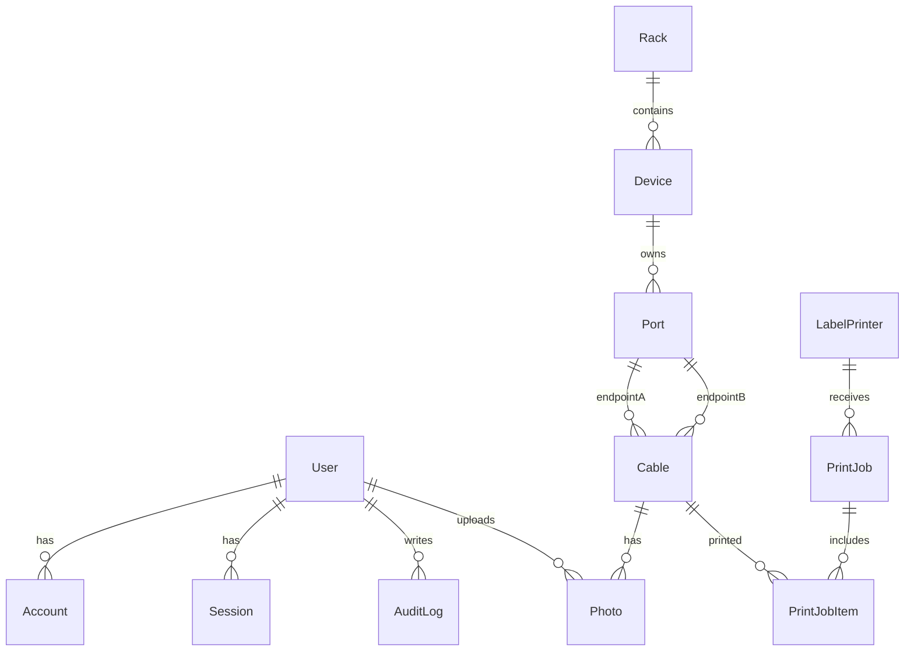
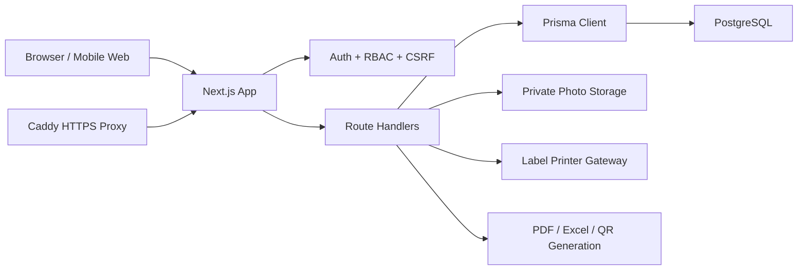

# 接线镜 / TraceEveryLink 产品开发需求文档

文档版本：v1.0  
产品版本：TraceEveryLink v0.1.0  
文档日期：2026-06-16  
适用范围：产品规划、研发实现、测试验收、部署运维、安全审查

---

## 1. 文档目的

本文档用于将接线镜（TraceEveryLink）的产品定位、业务需求、功能范围、技术栈、数据模型、接口能力、权限规则、部署方式与验收标准沉淀为一份可执行的产品开发需求文档。

文档面向以下读者：

- 产品负责人：明确业务价值、版本边界、优先级和后续路线图。
- 前端工程师：明确工作台页面、交互、状态、移动端适配和权限展示。
- 后端工程师：明确 API、数据库模型、认证、审计、导出、打印和文件存储要求。
- 测试工程师：明确功能验收、异常场景、权限矩阵和回归范围。
- 运维/安全负责人：明确公网部署、安全边界、备份、密钥、日志和数据库要求。

---

## 2. 产品概述

接线镜（TraceEveryLink）是一个面向机房现场的 Cisco 设备接线可视化系统。它用于记录、查询和复核交换机端口、配线架、墙口、AP、服务器之间的物理连接，让手机、Windows 和 Mac 用户都能通过网页直观看到“这根线从哪里来到哪里去”。

第一版按照公网部署设计：公网只开放登录入口，机房资产、接线、照片、导出文件和打印任务都必须鉴权后访问。

核心价值：

- 降低机房接线查找成本，减少人工翻 Excel、看纸质标签、现场猜线的时间。
- 提升接线变更的可追溯性，记录新增、复核、故障、退役和打印等关键操作。
- 让现场人员、网络管理员、复核人员和审计人员在同一个可信系统中协作。
- 用二维码标签把物理线缆与系统记录绑定，支持扫码定位线缆详情。
- 为后续接入 LLDP/CDP/SNMP 自动发现、变更审批、容量管理和资产治理打基础。

---

## 3. 背景与问题

### 3.1 当前痛点

机房接线管理在实际运维中常见以下问题：

- 线缆台账分散在 Excel、纸质记录、个人笔记或口头经验中。
- 交换机端口、配线架前后端、墙口、AP、服务器之间缺乏统一链路模型。
- 接线变更后没有及时复核，导致台账与真实环境偏差。
- 线缆标签内容有限，无法直接展示完整路径、状态、照片和变更记录。
- 新人或跨团队人员到现场排障时，很难快速判断某个端口连接到哪里。
- 对外网部署存在安全顾虑，照片和资产数据不能以静态目录方式裸露。
- 打印标签、导出报表、复核接线、审计追踪通常依赖多个不一致的工具。

### 3.2 产品机会

接线镜通过“可视化机柜 + 端口级数据模型 + 私有照片 + 二维码标签 + 权限审计”的组合，把机房物理连接管理从静态台账升级为可操作的现场工作台。

---

## 4. 产品目标

### 4.1 一期目标

- 支持用户登录后查看机柜、设备、端口和线缆。
- 支持 Cisco Catalyst 风格端口建模，例如 `Gi1/0/24`、`Te1/1/1`。
- 支持端口级接线记录，包括交换机、配线架、墙口、AP 和服务器。
- 支持基于配线架映射的路径追踪。
- 支持线缆状态流转：规划、草稿、待复核、已确认、故障、退役。
- 支持二维码标签生成、标签 PDF 导出和批量打印任务。
- 支持线缆/端口照片上传与鉴权访问。
- 支持 Excel/PDF 台账导出。
- 支持本地账号、TOTP MFA、Cisco/Google/GitHub OAuth/OIDC。
- 支持基于角色的权限控制和审计日志。
- 支持 Docker Compose + PostgreSQL + Caddy 的公网部署。
- 支持加密备份数据库与照片存储。

### 4.2 非目标

以下能力不属于一期必须完成范围：

- 自动发现真实网络拓扑。
- 实时 SNMP/LLDP/CDP 采集。
- 原生 iOS/Android App。
- 匿名公开查看页面。
- 完整资产采购、库存、报废流程。
- 多租户 SaaS 化。
- 拓扑画布编辑器。
- 与 CMDB、工单系统、监控系统的深度双向同步。
- 复杂审批流和电子签名。

---

## 5. 目标用户与角色

### 5.1 用户画像

| 用户 | 主要任务 | 典型场景 | 关注点 |
|---|---|---|---|
| 网络管理员 | 建模、维护接线、确认变更 | 新增交换机、调整端口、排障 | 准确性、可追溯、权限安全 |
| 现场工程师 | 查线、拍照、提交待复核接线 | 机房布线、替换线缆、贴标签 | 手机可用、快速定位、操作简单 |
| 复核人员 | 审核接线、导出报表、批量打印 | 接线完成后复核、出具台账 | 状态清晰、批量操作、导出稳定 |
| 系统管理员 | 配置登录、打印机、部署与备份 | 公网部署、账号安全、备份恢复 | 安全、稳定、可维护 |
| 审计/管理人员 | 查看记录、导出台账 | 资产审查、变更追踪 | 审计日志、数据完整性 |

### 5.2 权限角色

| 角色 | 等级 | 权限说明 |
|---|---:|---|
| `VIEWER` | 1 | 查看机柜、端口、线缆、照片、二维码；不能新增或修改数据。 |
| `SURVEYOR` | 2 | 拥有 VIEWER 权限；可新增线缆、上传照片、更新线缆为规划/草稿/待复核/故障/退役。 |
| `REVIEWER` | 3 | 拥有 SURVEYOR 权限；可确认线缆、导出 Excel/PDF、导出标签 PDF、批量打印标签。 |
| `ADMIN` | 4 | 拥有全部权限；可删除线缆、配置标签打印机、删除打印机。 |

权限为等级继承模式：高等级角色自动拥有低等级角色权限。

---

## 6. 成功指标

一期上线后建议跟踪以下指标：

| 指标 | 目标 |
|---|---|
| 查找线缆路径耗时 | 相比人工 Excel/纸质记录降低 50% 以上 |
| 接线记录覆盖率 | 核心机柜/接入机柜线缆记录覆盖率达到 90% 以上 |
| 待复核线缆处理时效 | 80% 待复核线缆在 2 个工作日内确认 |
| 标签绑定率 | 新增线缆二维码标签覆盖率达到 95% 以上 |
| 数据安全 | 公网部署下未鉴权请求无法访问资产、照片和导出文件 |
| 可恢复性 | 备份可定期生成，并能在测试环境完成恢复演练 |

---

## 7. 核心业务流程

### 7.1 登录与访问控制流程

1. 用户访问系统。
2. 未登录用户访问页面时跳转到 `/login?next=/目标路径`。
3. 用户使用本地账号或 OAuth/OIDC 登录。
4. 本地账号可启用 TOTP MFA。
5. 登录成功后服务端创建会话，写入 HTTP-only Cookie。
6. 用户进入接线工作台。
7. 所有资产、照片、导出和打印 API 均校验会话。

### 7.2 现场查线流程

1. 用户登录系统。
2. 在顶部搜索框输入线缆号、设备名、端口名或端点信息。
3. 从左侧线缆列表选择目标线缆，或在机柜视图中点击端口。
4. 右侧详情面板展示：
   - 端口信息
   - 线缆编号
   - 状态
   - A/B 端点
   - 二维码
   - 照片
   - 路径追踪
5. 用户可打开照片核对现场实物。
6. 用户可导出标签或扫描二维码回到该线缆详情。

### 7.3 新增线缆流程

1. `SURVEYOR` 及以上用户点击“新线缆”。
2. 输入线缆编号、标签、颜色。
3. 选择 A 端口和 B 端口。
4. 系统校验：
   - 线缆编号长度 3-80。
   - 标签长度 3-120。
   - A/B 端口不可相同。
   - 端口必须存在。
   - 非退役状态的活动线缆不能占用同一端口。
5. 系统创建草稿线缆。
6. 系统写入审计日志。
7. 工作台刷新线缆列表和机柜端口状态。

### 7.4 复核与确认流程

1. 现场工程师将线缆状态设置为 `pending_verification`。
2. 复核人员查看线缆详情、照片、路径。
3. `REVIEWER` 或 `ADMIN` 将线缆设置为 `confirmed`。
4. 系统记录 `verifiedById` 和 `verifiedAt`。
5. 系统写入更新审计日志。

### 7.5 标签打印流程

1. `ADMIN` 配置标签打印机。
2. `REVIEWER` 或 `ADMIN` 在左侧线缆列表勾选需要打印的线缆。
3. 用户点击批量打印。
4. 系统选择一个启用的打印机。
5. 系统创建打印任务和打印明细。
6. 系统按打印机协议发送：
   - `HTTP_JSON`
   - `HTTP_ZPL`
   - `HTTP_TSPL`
7. 根据打印网关响应更新任务状态：
   - `sent`
   - `failed`
8. 系统写入审计日志。

### 7.6 照片上传流程

1. 用户选择端口或线缆。
2. `SURVEYOR` 及以上用户上传图片。
3. 系统校验：
   - 必须是图片类型。
   - 文件大小不超过 8 MB。
   - 必须绑定到线缆或端口。
4. 系统生成随机文件名并写入私有照片目录。
5. 系统计算 SHA-256。
6. 系统写入 `Photo` 表。
7. 系统写入审计日志。
8. 照片只能通过鉴权 API 访问。

### 7.7 导出流程

1. `REVIEWER` 或 `ADMIN` 点击导出 Excel/PDF/标签。
2. 系统实时读取线缆数据和端点信息。
3. 系统生成文件响应。
4. 浏览器下载文件。

---

## 8. 页面与交互需求

### 8.1 登录页

路径：`/login`

页面元素：

- 邮箱输入框。
- 密码输入框。
- MFA/TOTP 输入框。
- 登录按钮。
- Cisco SSO、Google、GitHub 登录入口。
- 登录失败错误提示。

功能要求：

- 默认可填入管理员邮箱以方便开发环境。
- 本地登录提交到 `/api/auth/login`。
- 登录成功跳转到首页。
- 登录失败展示服务端返回错误。
- OAuth 未配置时应返回可读错误。

### 8.2 接线工作台

路径：`/`

页面区域：

- 顶部栏：
  - 产品名。
  - 页面标题。
  - 全局搜索框。
  - 当前用户与角色。
  - 刷新按钮。
  - 退出按钮。
- 左侧栏：
  - 机柜切换。
  - 线缆列表。
  - 多选线缆复选框。
  - 状态颜色点。
- 中央区域：
  - 机柜视图。
  - 设备卡片。
  - 端口网格。
  - 端口状态颜色。
- 右侧详情栏：
  - 新增线缆入口。
  - 导出 Excel。
  - 导出 PDF。
  - 标签 PDF。
  - 批量打印。
  - 端口详情。
  - 线缆详情。
  - 状态切换。
  - 二维码。
  - 路径追踪。
  - 照片上传与预览。
  - 最近审计日志。

搜索要求：

- 搜索范围包括线缆编号、线缆标签、A 端点、B 端点。
- 搜索应不区分大小写。
- 搜索结果应实时过滤左侧线缆列表。

端口视图要求：

- 点击端口后右侧展示端口详情。
- 如端口存在非退役活动线缆，应展示关联线缆。
- 端口按钮应根据线缆状态显示不同样式。

线缆详情要求：

- 展示线缆编号、标签、状态、端点、二维码和照片。
- 状态按钮依据当前用户权限禁用或启用。
- `confirmed` 只能由 `REVIEWER` 或 `ADMIN` 设置。

---

## 9. 功能需求

### 9.1 认证与会话

需求编号：AUTH

| 编号 | 需求 | 优先级 |
|---|---|---|
| AUTH-01 | 系统必须支持本地邮箱密码登录。 | P0 |
| AUTH-02 | 系统必须支持可选 TOTP MFA。 | P0 |
| AUTH-03 | 系统必须支持 Cisco、Google、GitHub OAuth/OIDC 登录入口。 | P1 |
| AUTH-04 | 未登录用户访问业务页面必须跳转登录页。 | P0 |
| AUTH-05 | 未登录用户访问业务 API 必须返回 401。 | P0 |
| AUTH-06 | 会话 Cookie 必须为 HTTP-only。 | P0 |
| AUTH-07 | 生产环境会话 Cookie 必须启用 Secure。 | P0 |
| AUTH-08 | 登录失败必须写入审计日志。 | P0 |
| AUTH-09 | 登录接口必须有基础限流。 | P0 |

### 9.2 库存与机柜视图

需求编号：INV

| 编号 | 需求 | 优先级 |
|---|---|---|
| INV-01 | 系统必须支持机柜、设备、端口、线缆、打印机、审计日志聚合查询。 | P0 |
| INV-02 | 机柜应按机房和机柜编码排序。 | P1 |
| INV-03 | 设备应按 U 位从高到低展示。 | P1 |
| INV-04 | 端口应按端口号和名称排序。 | P1 |
| INV-05 | 无机柜设备应作为现场设备或外部端点展示。 | P0 |
| INV-06 | 工作台应支持刷新最新库存快照。 | P0 |

### 9.3 端口模型

需求编号：PORT

| 编号 | 需求 | 优先级 |
|---|---|---|
| PORT-01 | 系统必须支持 Cisco Catalyst 风格端口名。 | P0 |
| PORT-02 | 端口必须归属于设备。 | P0 |
| PORT-03 | 同一设备下端口名称必须唯一。 | P0 |
| PORT-04 | 端口应支持类型、速率、PoE、状态、堆叠、模块、端口号字段。 | P0 |
| PORT-05 | 配线架前后端口应支持 `mappedPortId` 映射。 | P0 |
| PORT-06 | 预留 SNMP ifIndex、LLDP、CDP 字段。 | P2 |

### 9.4 线缆管理

需求编号：CABLE

| 编号 | 需求 | 优先级 |
|---|---|---|
| CABLE-01 | 用户必须登录后才能查看线缆列表。 | P0 |
| CABLE-02 | `SURVEYOR` 及以上角色可新增线缆。 | P0 |
| CABLE-03 | 新线缆必须绑定两个不同端口。 | P0 |
| CABLE-04 | 非退役活动线缆不得占用同一端口。 | P0 |
| CABLE-05 | 线缆编号必须唯一。 | P0 |
| CABLE-06 | 线缆状态必须限制在枚举值内。 | P0 |
| CABLE-07 | `REVIEWER` 或 `ADMIN` 才能确认线缆。 | P0 |
| CABLE-08 | `ADMIN` 才能删除线缆。 | P0 |
| CABLE-09 | 新增、更新、删除线缆必须写入审计日志。 | P0 |

线缆状态枚举：

| 状态 | 中文含义 | 用途 |
|---|---|---|
| `planned` | 规划 | 已设计但尚未实施。 |
| `draft` | 草稿 | 初始录入，尚未提交复核。 |
| `pending_verification` | 待复核 | 现场完成，等待复核确认。 |
| `confirmed` | 已确认 | 复核通过，可作为可信台账。 |
| `faulty` | 故障 | 线缆或链路存在问题。 |
| `retired` | 退役 | 已不再使用，不参与活动端口占用和路径追踪。 |

### 9.5 路径追踪

需求编号：TRACE

| 编号 | 需求 | 优先级 |
|---|---|---|
| TRACE-01 | 系统必须从任意端口计算可达路径。 | P0 |
| TRACE-02 | 路径计算必须包含活动线缆连接。 | P0 |
| TRACE-03 | 路径计算必须包含配线架端口映射。 | P0 |
| TRACE-04 | `retired` 线缆不得参与路径追踪。 | P0 |
| TRACE-05 | 存在多条路径时，优先展示最长路径。 | P1 |

### 9.6 二维码与标签

需求编号：LABEL

| 编号 | 需求 | 优先级 |
|---|---|---|
| LABEL-01 | 每根线缆必须可生成二维码。 | P0 |
| LABEL-02 | 二维码 URL 应指向 `/?cable={线缆数据库ID}`。 | P0 |
| LABEL-03 | 标签 PDF 应包含线缆编号、A/B 端点、状态和二维码。 | P0 |
| LABEL-04 | 用户可导出全部标签 PDF。 | P0 |
| LABEL-05 | 用户可导出选中线缆的标签 PDF。 | P0 |
| LABEL-06 | 标签导出需要 `REVIEWER` 或 `ADMIN` 权限。 | P0 |

### 9.7 照片管理

需求编号：PHOTO

| 编号 | 需求 | 优先级 |
|---|---|---|
| PHOTO-01 | `SURVEYOR` 及以上角色可上传照片。 | P0 |
| PHOTO-02 | 照片必须绑定线缆或端口。 | P0 |
| PHOTO-03 | 只允许图片类型。 | P0 |
| PHOTO-04 | 单张图片大小不得超过 8 MB。 | P0 |
| PHOTO-05 | 照片文件必须存储在私有目录。 | P0 |
| PHOTO-06 | 照片访问必须通过鉴权 API。 | P0 |
| PHOTO-07 | 上传照片必须写入审计日志。 | P0 |
| PHOTO-08 | 系统应记录原始文件名、MIME、大小、SHA-256 和上传人。 | P0 |

### 9.8 导出

需求编号：EXPORT

| 编号 | 需求 | 优先级 |
|---|---|---|
| EXPORT-01 | 系统必须支持线缆台账 Excel 导出。 | P0 |
| EXPORT-02 | 系统必须支持线缆台账 PDF 导出。 | P0 |
| EXPORT-03 | 系统必须支持标签 PDF 导出。 | P0 |
| EXPORT-04 | 导出接口必须要求 `REVIEWER` 或 `ADMIN` 权限。 | P0 |
| EXPORT-05 | Excel 台账应包含线缆编号、标签、状态、介质、颜色、长度、A/B 端点和更新时间。 | P0 |

### 9.9 标签打印机

需求编号：PRINT

| 编号 | 需求 | 优先级 |
|---|---|---|
| PRINT-01 | `ADMIN` 可新增标签打印机配置。 | P0 |
| PRINT-02 | `ADMIN` 可修改标签打印机配置。 | P0 |
| PRINT-03 | `ADMIN` 可删除标签打印机配置。 | P0 |
| PRINT-04 | 打印机 API key 不得在普通查询和审计日志中明文暴露。 | P0 |
| PRINT-05 | 支持 `HTTP_JSON` 打印网关。 | P0 |
| PRINT-06 | 支持 `HTTP_ZPL` 打印网关。 | P1 |
| PRINT-07 | 支持 `HTTP_TSPL` 打印网关。 | P1 |
| PRINT-08 | `REVIEWER` 或 `ADMIN` 可提交批量打印任务。 | P0 |
| PRINT-09 | 打印任务应记录 `queued`、`sent`、`failed` 状态。 | P0 |
| PRINT-10 | 打印失败必须记录错误信息。 | P0 |

### 9.10 审计日志

需求编号：AUDIT

| 编号 | 需求 | 优先级 |
|---|---|---|
| AUDIT-01 | 登录失败必须记录。 | P0 |
| AUDIT-02 | MFA 失败必须记录。 | P0 |
| AUDIT-03 | 登录成功必须记录。 | P0 |
| AUDIT-04 | OAuth 登录必须记录。 | P0 |
| AUDIT-05 | 新增、更新、删除线缆必须记录。 | P0 |
| AUDIT-06 | 上传照片必须记录。 | P0 |
| AUDIT-07 | 打印任务必须记录。 | P0 |
| AUDIT-08 | 打印机新增、更新、删除必须记录。 | P0 |
| AUDIT-09 | 审计日志应包含操作人、动作、实体类型、实体 ID、旧值、新值、IP、时间。 | P0 |

---

## 10. API 需求

所有业务 API 默认要求登录。带修改语义的请求必须校验 CSRF Token。

### 10.1 认证 API

| 方法 | 路径 | 权限 | 说明 |
|---|---|---|---|
| `POST` | `/api/auth/login` | 公开 | 本地账号登录，支持 MFA。 |
| `POST` | `/api/auth/logout` | 登录用户 | 注销当前会话。 |
| `GET` | `/api/auth/session` | 登录用户 | 获取当前用户和 CSRF Token。 |
| `GET` | `/api/auth/oauth/{provider}` | 公开 | 发起 OAuth 登录。 |
| `GET` | `/api/auth/oauth/{provider}/callback` | 公开 | OAuth 回调并创建会话。 |

登录请求：

```json
{
  "email": "admin@example.com",
  "password": "ChangeMe123!",
  "totp": "123456"
}
```

登录成功响应：

```json
{
  "user": {
    "id": "user-id",
    "email": "admin@example.com",
    "name": "TraceEveryLink Admin",
    "role": "ADMIN"
  },
  "csrfToken": "token"
}
```

### 10.2 库存 API

| 方法 | 路径 | 权限 | 说明 |
|---|---|---|---|
| `GET` | `/api/inventory` | 登录用户 | 返回机柜、无机柜设备、线缆、打印机、最近审计日志。 |

响应结构：

```json
{
  "racks": [],
  "devicesWithoutRack": [],
  "cables": [],
  "printers": [],
  "auditLogs": []
}
```

### 10.3 线缆 API

| 方法 | 路径 | 权限 | 说明 |
|---|---|---|---|
| `GET` | `/api/cables` | 登录用户 | 获取线缆列表。 |
| `POST` | `/api/cables` | `SURVEYOR+` | 新增线缆。 |
| `PATCH` | `/api/cables/{id}` | `SURVEYOR+` | 更新线缆状态或备注。 |
| `DELETE` | `/api/cables/{id}` | `ADMIN` | 删除线缆。 |
| `GET` | `/api/cables/{id}/qr` | 登录用户 | 返回线缆二维码 PNG。 |

新增线缆请求：

```json
{
  "cableId": "CBL-MDF01-R01-GI1-0-1",
  "label": "R01-U36 Gi1/0/1 -> PP01-F01",
  "endpointAPortId": "port-a",
  "endpointBPortId": "port-b",
  "status": "draft",
  "media": "COPPER",
  "color": "blue",
  "lengthM": 2,
  "notes": "optional"
}
```

更新线缆请求：

```json
{
  "status": "confirmed",
  "notes": "复核通过"
}
```

### 10.4 照片 API

| 方法 | 路径 | 权限 | 说明 |
|---|---|---|---|
| `POST` | `/api/photos` | `SURVEYOR+` | 上传照片。 |
| `GET` | `/api/photos/{id}` | 登录用户 | 读取私有照片。 |

上传要求：

- `multipart/form-data`
- 字段 `file` 必填。
- 字段 `cableId` 或 `portId` 至少一个必填。
- 图片大小不超过 8 MB。

### 10.5 导出 API

| 方法 | 路径 | 权限 | 文件 |
|---|---|---|---|
| `GET` | `/api/exports/excel` | `REVIEWER+` | `traceeverylink-cables.xls` |
| `GET` | `/api/exports/pdf` | `REVIEWER+` | `traceeverylink-cables.pdf` |
| `GET` | `/api/exports/labels` | `REVIEWER+` | `traceeverylink-labels.pdf` |
| `GET` | `/api/exports/labels?ids=id1,id2` | `REVIEWER+` | 选中线缆标签 PDF |

### 10.6 打印 API

| 方法 | 路径 | 权限 | 说明 |
|---|---|---|---|
| `GET` | `/api/printers` | 登录用户 | 查询打印机配置，不返回 API key。 |
| `POST` | `/api/printers` | `ADMIN` | 新增打印机。 |
| `PATCH` | `/api/printers/{id}` | `ADMIN` | 更新打印机。 |
| `DELETE` | `/api/printers/{id}` | `ADMIN` | 删除打印机。 |
| `GET` | `/api/printing/jobs` | `REVIEWER+` | 查询最近打印任务。 |
| `POST` | `/api/printing/jobs` | `REVIEWER+` | 提交打印任务。 |

打印机配置请求：

```json
{
  "name": "Rack Label Printer",
  "protocol": "HTTP_JSON",
  "endpoint": "https://printer-gateway.example.com/api/print",
  "apiKey": "optional-bearer-token",
  "enabled": true,
  "notes": "机房标签打印网关"
}
```

打印任务请求：

```json
{
  "printerId": "printer-id",
  "cableIds": ["cable-id-1", "cable-id-2"],
  "copies": 1
}
```

---

## 11. 数据模型需求

数据库：PostgreSQL  
ORM：Prisma

### 11.1 实体关系概览



### 11.2 核心实体

#### User

| 字段 | 类型 | 说明 |
|---|---|---|
| `id` | String | 用户 ID。 |
| `email` | String | 唯一邮箱。 |
| `name` | String | 用户名称。 |
| `passwordHash` | String | 密码哈希。 |
| `role` | Role | 用户角色。 |
| `mfaSecret` | String? | TOTP 密钥。 |
| `mfaEnabled` | Boolean | 是否启用 MFA。 |
| `createdAt` | DateTime | 创建时间。 |
| `updatedAt` | DateTime | 更新时间。 |

#### Rack

| 字段 | 类型 | 说明 |
|---|---|---|
| `id` | String | 机柜 ID。 |
| `code` | String | 唯一机柜编码。 |
| `name` | String | 机柜名称。 |
| `room` | String | 机房。 |
| `heightU` | Int | 机柜高度，默认 42U。 |
| `row` | String? | 排。 |
| `position` | String? | 位置。 |

#### Device

| 字段 | 类型 | 说明 |
|---|---|---|
| `id` | String | 设备 ID。 |
| `rackId` | String? | 所属机柜，可为空。 |
| `name` | String | 设备名称。 |
| `vendor` | String? | 厂商。 |
| `model` | String? | 型号。 |
| `type` | DeviceType | 设备类型。 |
| `uPosition` | Int? | U 位。 |
| `uHeight` | Int | 高度。 |
| `mgmtIp` | String? | 管理 IP。 |
| `serial` | String? | 序列号。 |
| `notes` | String? | 备注。 |

#### Port

| 字段 | 类型 | 说明 |
|---|---|---|
| `id` | String | 端口 ID。 |
| `deviceId` | String | 所属设备。 |
| `name` | String | 端口名。 |
| `label` | String? | 展示标签。 |
| `type` | PortType | 端口类型。 |
| `speed` | String? | 速率。 |
| `poeEnabled` | Boolean | 是否 PoE。 |
| `status` | String | 端口状态。 |
| `stack` | Int? | 堆叠号。 |
| `module` | Int? | 模块号。 |
| `portNumber` | Int? | 端口号。 |
| `mappedPortId` | String? | 配线架映射端口。 |
| `discoveryProtocol` | String? | 预留发现协议。 |
| `discoveryNeighbor` | String? | 预留发现邻居。 |
| `snmpIfIndex` | Int? | 预留 SNMP ifIndex。 |

#### Cable

| 字段 | 类型 | 说明 |
|---|---|---|
| `id` | String | 数据库 ID。 |
| `cableId` | String | 业务线缆编号，唯一。 |
| `label` | String | 线缆标签。 |
| `status` | CableStatus | 状态。 |
| `media` | CableMedia | 介质。 |
| `color` | String? | 颜色。 |
| `lengthM` | Float? | 长度，米。 |
| `endpointAPortId` | String | A 端口。 |
| `endpointBPortId` | String | B 端口。 |
| `notes` | String? | 备注。 |
| `lldpSnapshot` | Json? | 预留 LLDP 快照。 |
| `cdpSnapshot` | Json? | 预留 CDP 快照。 |
| `createdById` | String? | 创建人。 |
| `verifiedById` | String? | 复核人。 |
| `verifiedAt` | DateTime? | 复核时间。 |

#### Photo

| 字段 | 类型 | 说明 |
|---|---|---|
| `id` | String | 照片 ID。 |
| `cableId` | String? | 关联线缆。 |
| `portId` | String? | 关联端口。 |
| `filename` | String | 私有存储文件名。 |
| `originalName` | String | 原始文件名。 |
| `mimeType` | String | MIME 类型。 |
| `size` | Int | 文件大小。 |
| `sha256` | String | 文件哈希。 |
| `uploadedById` | String | 上传人。 |

#### LabelPrinter

| 字段 | 类型 | 说明 |
|---|---|---|
| `id` | String | 打印机 ID。 |
| `name` | String | 打印机名称。 |
| `protocol` | PrintProtocol | 协议。 |
| `endpoint` | String | 打印网关 URL。 |
| `apiKey` | String? | 可选 Bearer Token。 |
| `enabled` | Boolean | 是否启用。 |
| `notes` | String? | 备注。 |

#### AuditLog

| 字段 | 类型 | 说明 |
|---|---|---|
| `id` | String | 日志 ID。 |
| `actorId` | String? | 操作人。 |
| `action` | String | 动作。 |
| `entityType` | String | 实体类型。 |
| `entityId` | String | 实体 ID。 |
| `oldValue` | Json? | 修改前。 |
| `newValue` | Json? | 修改后。 |
| `ip` | String? | 客户端 IP。 |
| `createdAt` | DateTime | 时间。 |

---

## 12. 技术架构

### 12.1 技术栈

| 层级 | 技术 | 版本/说明 |
|---|---|---|
| 应用框架 | Next.js | 16.2.9，App Router，Turbopack 开发模式 |
| UI 框架 | React | 19.2.7 |
| 语言 | TypeScript | 5.9.3 |
| ORM | Prisma | 6.19.3 |
| 数据库 | PostgreSQL | Docker Compose 默认 Postgres 17，本地可用 Postgres 16+ |
| 校验 | Zod | 4.4.3 |
| 密码哈希 | bcryptjs | 3.0.3 |
| MFA | otplib | 13.4.1 |
| 二维码 | qrcode | 1.5.4 |
| PDF | pdfkit | 0.17.2 |
| 图标 | lucide-react | 1.18.0 |
| 测试 | Vitest | 4.1.9 |
| 部署 | Docker Compose | App + DB + Migrate + Caddy |
| 反向代理 | Caddy | 自动 HTTPS |

### 12.2 逻辑架构



### 12.3 目录职责

| 路径 | 职责 |
|---|---|
| `prisma/schema.prisma` | 数据库模型与枚举。 |
| `prisma/seed.ts` | 初始化管理员、机柜、设备、端口、线缆、打印机示例。 |
| `src/app/page.tsx` | 主工作台服务端入口。 |
| `src/app/DashboardClient.tsx` | 工作台客户端交互。 |
| `src/app/login` | 登录页。 |
| `src/app/api` | 认证、库存、线缆、照片、导出、打印 API。 |
| `src/server/auth.ts` | 会话、密码、MFA、请求认证。 |
| `src/server/oauth.ts` | OAuth/OIDC 登录。 |
| `src/server/inventory.ts` | 库存聚合查询。 |
| `src/server/network-model.ts` | Cisco 端口校验、路径追踪。 |
| `src/server/exports.ts` | Excel/PDF/标签导出。 |
| `src/server/printing.ts` | 打印任务与协议渲染。 |
| `src/server/audit.ts` | 审计日志写入。 |
| `scripts/backup.sh` | 加密备份脚本。 |

---

## 13. 安全需求

| 编号 | 需求 | 优先级 |
|---|---|---|
| SEC-01 | 公网部署不得提供匿名资产访问。 | P0 |
| SEC-02 | 照片不得通过静态目录公开。 | P0 |
| SEC-03 | 修改类 API 必须校验 CSRF Token。 | P0 |
| SEC-04 | 会话 Cookie 必须 HTTP-only。 | P0 |
| SEC-05 | 生产环境 Cookie 必须 Secure。 | P0 |
| SEC-06 | 密码必须哈希存储。 | P0 |
| SEC-07 | 管理员账号生产环境必须启用 MFA。 | P0 |
| SEC-08 | OAuth 自动创建用户默认角色必须为 `VIEWER`。 | P0 |
| SEC-09 | 可配置允许登录的邮箱域名。 | P1 |
| SEC-10 | 打印机 API key 必须脱敏。 | P0 |
| SEC-11 | 数据库不得直接暴露到公网。 | P0 |
| SEC-12 | Caddy 应设置基础安全响应头。 | P0 |
| SEC-13 | 备份文件应加密保存。 | P0 |

安全响应头：

- `Strict-Transport-Security`
- `X-Content-Type-Options`
- `X-Frame-Options`
- `Referrer-Policy`

---

## 14. 非功能需求

### 14.1 性能

| 编号 | 需求 |
|---|---|
| PERF-01 | 首屏加载应能在常规办公网络下 3 秒内完成。 |
| PERF-02 | 库存快照查询在 5000 条线缆以内应在 2 秒内返回。 |
| PERF-03 | 搜索过滤应在前端即时响应。 |
| PERF-04 | 二维码生成应在单次请求内完成，无需预生成。 |
| PERF-05 | 导出大台账时应避免阻塞数据库长时间锁。 |

### 14.2 可用性

| 编号 | 需求 |
|---|---|
| UX-01 | 页面必须支持桌面浏览器。 |
| UX-02 | 页面必须支持手机浏览器现场查看。 |
| UX-03 | 关键操作按钮应根据权限禁用。 |
| UX-04 | 失败操作应给出可读反馈。 |
| UX-05 | 搜索、刷新、退出、导出、打印等常用操作应在工作台首屏可达。 |

### 14.3 可靠性

| 编号 | 需求 |
|---|---|
| REL-01 | 数据库连接失败时应记录服务端错误。 |
| REL-02 | 打印网关失败不应导致打印任务丢失。 |
| REL-03 | 上传照片时应先写入文件再创建数据库记录，避免记录指向不存在文件。 |
| REL-04 | 备份脚本应支持定期执行。 |

### 14.4 可维护性

| 编号 | 需求 |
|---|---|
| MAINT-01 | 所有输入必须通过 Zod 或等效方式校验。 |
| MAINT-02 | 权限规则集中维护。 |
| MAINT-03 | 数据模型变更必须通过 Prisma 管理。 |
| MAINT-04 | 核心网络模型必须有单元测试。 |
| MAINT-05 | RBAC 必须有单元测试。 |

---

## 15. 环境变量需求

| 变量 | 必填 | 说明 |
|---|---|---|
| `DATABASE_URL` | 是 | PostgreSQL 连接字符串。 |
| `NEXT_PUBLIC_APP_URL` | 是 | 浏览器侧应用 URL。 |
| `APP_URL` | 是 | 服务端生成 OAuth、二维码、回调 URL。 |
| `SESSION_SECRET` | 是 | 会话相关密钥，生产环境必须替换。 |
| `ADMIN_EMAIL` | 是 | seed 初始化管理员邮箱。 |
| `ADMIN_PASSWORD` | 是 | seed 初始化管理员密码。 |
| `ADMIN_MFA_ENABLED` | 否 | 开发可为 false，生产建议 true。 |
| `ADMIN_TOTP_SECRET` | 否 | 管理员 TOTP 密钥。 |
| `PHOTO_STORAGE_DIR` | 是 | 照片私有存储目录。 |
| `BACKUP_ENCRYPTION_PASSPHRASE` | 是 | 备份加密口令。 |
| `OAUTH_AUTO_PROVISION` | 否 | OAuth 用户是否自动创建。 |
| `ALLOWED_EMAIL_DOMAINS` | 否 | 允许登录的邮箱域名列表。 |
| `GOOGLE_CLIENT_ID` | 否 | Google OAuth Client ID。 |
| `GOOGLE_CLIENT_SECRET` | 否 | Google OAuth Secret。 |
| `GITHUB_CLIENT_ID` | 否 | GitHub OAuth Client ID。 |
| `GITHUB_CLIENT_SECRET` | 否 | GitHub OAuth Secret。 |
| `CISCO_CLIENT_ID` | 否 | Cisco OIDC Client ID。 |
| `CISCO_CLIENT_SECRET` | 否 | Cisco OIDC Secret。 |
| `CISCO_OIDC_ISSUER` | 否 | Cisco OIDC discovery issuer。 |
| `CISCO_AUTHORIZATION_URL` | 否 | Cisco 授权端点。 |
| `CISCO_TOKEN_URL` | 否 | Cisco token 端点。 |
| `CISCO_USERINFO_URL` | 否 | Cisco userinfo 端点。 |

---

## 16. 部署与运维需求

### 16.1 本地开发

```powershell
npm install
Copy-Item .env.example .env
npm run db:push
npm run db:seed
npm run dev
```

本地如果没有 PostgreSQL，可使用 Docker：

```powershell
docker run --name patchplan-postgres `
  -e POSTGRES_DB=patchplan `
  -e POSTGRES_USER=patchplan `
  -e POSTGRES_PASSWORD=patchplan `
  -p 5432:5432 `
  -d postgres:16
```

### 16.2 生产部署

生产部署建议使用 Docker Compose：

- `db`：PostgreSQL。
- `migrate`：执行 Prisma schema push 和 seed。
- `app`：Next.js 应用。
- `caddy`：HTTPS 反向代理。

公网防火墙要求：

- 只开放 `80` 和 `443`。
- SSH 使用密钥登录并限制来源。
- PostgreSQL 不开放公网端口。

### 16.3 备份

备份脚本：`scripts/backup.sh`

备份内容：

- 加密 PostgreSQL dump。
- 加密照片 volume。
- 自动删除 30 天以前备份。

运维要求：

- 每日至少备份一次。
- 每月至少进行一次恢复演练。
- 备份应同步到独立存储。
- 备份口令不得与数据库密码相同。

---

## 17. 测试与验收

### 17.1 已有测试

| 测试文件 | 覆盖范围 |
|---|---|
| `src/server/network-model.test.ts` | Cisco 端口识别、路径追踪。 |
| `src/server/rbac.test.ts` | 角色等级继承和权限判断。 |

### 17.2 基础验证命令

```sh
npm audit --audit-level=moderate
npm run typecheck
npm run test
npm run build
```

### 17.3 功能验收清单

| 场景 | 验收标准 |
|---|---|
| 未登录访问首页 | 自动跳转登录页。 |
| 未登录访问 API | 返回 401。 |
| 管理员本地登录 | 邮箱密码正确时进入工作台。 |
| MFA 开启登录 | 必须输入正确 TOTP。 |
| 查看库存 | 机柜、设备、端口、线缆正常展示。 |
| 搜索线缆 | 输入线缆号或端点后列表过滤正确。 |
| 点击端口 | 详情区显示端口和关联线缆。 |
| 新增线缆 | 合法请求创建成功并写审计。 |
| 重复占用端口 | 返回 409。 |
| 确认线缆 | `REVIEWER+` 成功，低权限失败。 |
| 删除线缆 | `ADMIN` 成功，低权限失败。 |
| 上传照片 | 图片上传成功，非图片失败，超 8 MB 失败。 |
| 访问照片 | 登录可访问，未登录不可访问。 |
| 导出 Excel/PDF | `REVIEWER+` 可下载，低权限失败。 |
| 导出标签 PDF | 全量和选中线缆均可生成。 |
| 提交打印任务 | 启用打印机时生成任务并记录状态。 |
| 打印机 API key | 查询和审计中不明文暴露。 |
| 审计日志 | 登录、改线、上传、打印、打印机配置均有记录。 |

### 17.4 权限验收矩阵

| 功能 | VIEWER | SURVEYOR | REVIEWER | ADMIN |
|---|---:|---:|---:|---:|
| 查看工作台 | 是 | 是 | 是 | 是 |
| 查看照片 | 是 | 是 | 是 | 是 |
| 新增线缆 | 否 | 是 | 是 | 是 |
| 上传照片 | 否 | 是 | 是 | 是 |
| 更新普通状态 | 否 | 是 | 是 | 是 |
| 确认线缆 | 否 | 否 | 是 | 是 |
| 导出 Excel/PDF | 否 | 否 | 是 | 是 |
| 导出标签 PDF | 否 | 否 | 是 | 是 |
| 批量打印 | 否 | 否 | 是 | 是 |
| 配置打印机 | 否 | 否 | 否 | 是 |
| 删除线缆 | 否 | 否 | 否 | 是 |

---

## 18. 里程碑建议

### M1：本地可用版本

目标：

- 完成本地 PostgreSQL 初始化。
- 完成默认管理员登录。
- 完成种子数据展示。
- 完成基础查线、新增线缆、状态更新。

验收：

- `npm run typecheck` 通过。
- `npm run test` 通过。
- 管理员可登录并查看示例机柜。

### M2：现场试用版本

目标：

- 完成真实机柜、设备、端口、线缆初始化。
- 完成照片上传。
- 完成二维码标签导出。
- 完成现场手机浏览器验证。

验收：

- 至少一个真实机柜录入完成。
- 新增线缆、待复核、确认流程跑通。
- 标签贴到线缆后扫码可定位详情。

### M3：公网部署版本

目标：

- 完成 Docker Compose 部署。
- 完成 Caddy HTTPS。
- 启用生产管理员 MFA。
- 完成备份脚本与恢复演练。

验收：

- 只有登录入口公网可访问。
- 业务 API 未登录均返回 401。
- 数据库端口不暴露公网。
- 备份可恢复到测试环境。

### M4：运维增强版本

目标：

- 增加用户/角色管理 UI。
- 增加资产导入工具。
- 增加更完整的打印机管理页面。
- 增加操作筛选和审计检索。

---

## 19. 后续路线图

| 阶段 | 能力 | 说明 |
|---|---|---|
| V1.1 | 资产批量导入 | 从 CSV/Excel 导入机柜、设备、端口和线缆。 |
| V1.2 | 用户管理 | 管理员通过 UI 创建用户、分配角色、重置 MFA。 |
| V1.3 | 变更审批 | 新接线、改线、退役进入审批流。 |
| V1.4 | 自动发现 | 接入 LLDP/CDP/SNMP，生成待确认发现结果。 |
| V1.5 | 拓扑视图 | 在机柜视图之外提供链路拓扑图。 |
| V1.6 | 告警关联 | 与监控系统联动，故障端口直接映射物理路径。 |
| V1.7 | 多站点 | 支持多个机房/园区/区域的隔离管理。 |

---

## 20. 风险与约束

| 风险 | 影响 | 缓解措施 |
|---|---|---|
| 台账初始录入工作量大 | 上线速度慢 | 提供 Excel/CSV 导入工具，先覆盖核心机柜。 |
| 数据与真实接线不一致 | 用户信任下降 | 强制待复核状态和照片证据。 |
| 打印机网关差异大 | 打印失败率高 | 保持 HTTP_JSON/ZPL/TSPL 多协议适配。 |
| 公网部署配置错误 | 数据泄露风险 | 默认鉴权、数据库不暴露、照片私有目录。 |
| OAuth 配置复杂 | 登录失败 | 保留本地管理员账号作为兜底。 |
| 二维码 URL 变化 | 标签失效 | 生产部署前固定 `APP_URL`，域名变更需重打标签。 |

---

## 21. 待确认问题

- 是否需要在 UI 中提供用户管理、角色变更、禁用账号能力？
- 是否需要支持多个机房/站点的权限隔离？
- 线缆编号规则是否需要强制格式，例如机房-机柜-U位-端口？
- 是否需要支持线缆两端之外的中间节点描述？
- 标签尺寸是否固定为当前 PDF 尺寸，还是需要按打印机模板配置？
- 照片是否需要压缩、缩略图和 EXIF 清理？
- 是否需要从交换机配置或 LLDP/CDP 自动生成待确认线缆？
- 是否需要和现有 CMDB、工单系统或资产系统同步？

---

## 22. 附录：开发阶段默认账号

开发环境默认管理员：

```text
邮箱：admin@example.com
密码：ChangeMe123!
MFA：默认关闭
```

生产环境必须：

- 修改默认管理员密码。
- 设置强 `SESSION_SECRET`。
- 修改数据库密码。
- 设置 `ADMIN_MFA_ENABLED="true"`。
- 替换 `ADMIN_TOTP_SECRET`。
- 固定 `APP_URL` 和 `NEXT_PUBLIC_APP_URL`。
