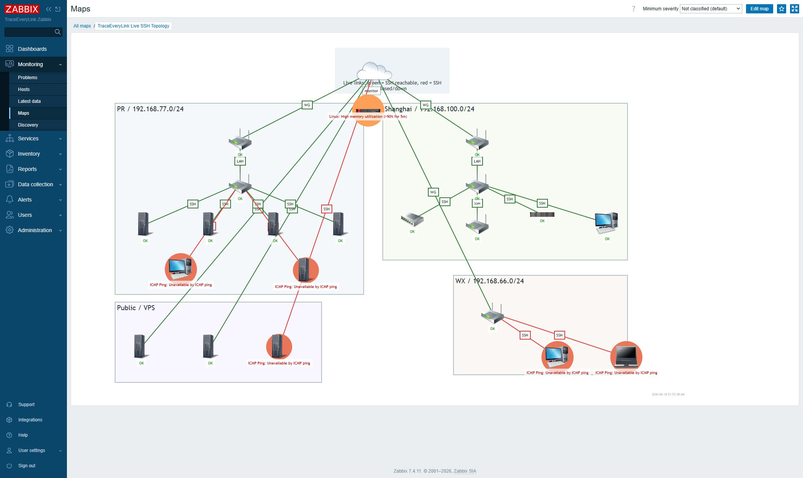

# TraceEveryLink Zabbix Handoff

This folder contains a local handoff page and screenshots for the Zabbix instance deployed on PVE.

## Access

- URL: <http://192.168.77.212/zabbix/>
- Login: `lawrence`
- Password: `Wht199625!`
- PVE CT: `105`
- Container IP: `192.168.77.212`

Do not commit or publish this file because it contains the local Zabbix password.

## What Was Configured

- Zabbix 7.4 on Ubuntu 24.04 LXC.
- MariaDB, Apache, Zabbix server, and Zabbix agent are active.
- Host group: `TraceEveryLink SSH Config`.
- 20 unique SSH config endpoints were imported.
- Each endpoint has ICMP ping and explicit SSH TCP checks.
- `nas` uses SSH TCP port `12222`; the rest use port `22`.
- Trigger rule: if ping is up but SSH TCP is closed, Zabbix raises a warning.
- Map: `TraceEveryLink Live SSH Topology`.

## Strongest Demo

Open the live topology map:

<http://192.168.77.212/zabbix/zabbix.php?action=map.view&sysmapid=2>

The map groups endpoints by site and uses Zabbix link indicators:

- Green line: SSH TCP check is reachable.
- Red line: SSH TCP check is closed or the endpoint is down.
- Red host bubble: active problem detected by Zabbix triggers.

Static showcase page:

- Open `zabbix-showcase.html` in this folder.

Screenshot:

## Current Snapshot

- Imported endpoints: 20
- Ping up + SSH open: 15
- Down or SSH closed: 5
- Currently down/closed: `cu`, `ubuntu`, `srv`, `win11`, `macbook`

## Next Useful Step

For deeper monitoring, install Zabbix agent or agent2 on Linux/Windows hosts and SNMP on routers/switches. Then this can show CPU, memory, disk, interface traffic, service status, logs, hardware sensors, and long-term trend graphs instead of only reachability.
