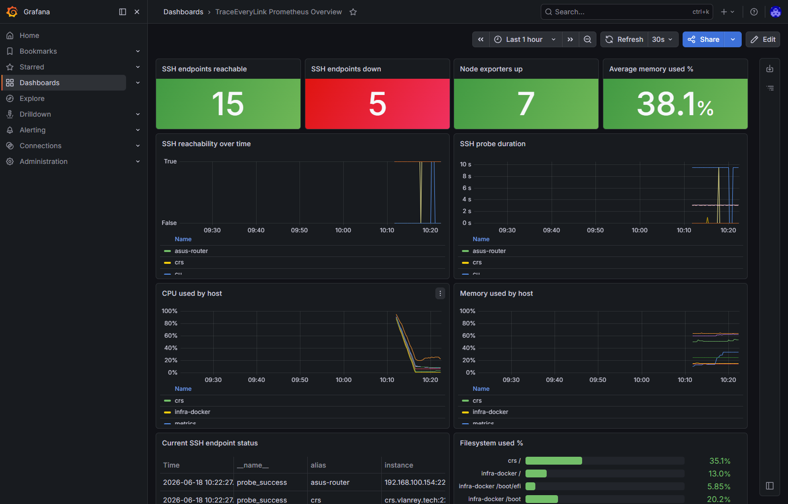

# TraceEveryLink Prometheus + Grafana Handoff

This folder contains the handoff material for the Prometheus/Grafana stack deployed on PVE.

## Access

- Grafana: <http://192.168.77.213:3000/>
- Prometheus: <http://192.168.77.213:9090/>
- Login: `lawrence`
- Password: `Wht199625!`
- PVE CT: `106`
- Container hostname: `metrics`
- Container IP: `192.168.77.213`

Do not commit or publish this file because it contains local credentials.

## What Was Deployed

- Ubuntu 24.04 LXC on PVE.
- Prometheus `2.45.3` from Ubuntu packages.
- Grafana `13.0.2` from the official Grafana APT repository.
- blackbox_exporter `0.24.0`.
- node_exporter `1.7.0` from packages where available.
- node_exporter `1.11.0` static binary on PVE and NAS because their apt sources were not usable for this package.

## What Was Connected

All 20 unique SSH config endpoints are connected through Prometheus blackbox TCP checks.

Deep node_exporter metrics are active for:

- `metrics` at `192.168.77.213:9100`
- `zabbix` at `192.168.77.212:9100`
- `pve` at `192.168.77.160:9100`
- `infra-docker` at `192.168.77.210:9100`
- `pi` at `192.168.77.197:9100`
- `nas` at `192.168.100.246:9100`
- `crs` at `crs.vlanrey.tech:9100`

Current blackbox snapshot:

- SSH reachable: 15
- SSH down/closed: 5
- Down/closed: `cu`, `ubuntu`, `srv`, `win11`, `macbook`
- Node exporters up: 7

## Grafana Dashboard

Open:

<http://192.168.77.213:3000/d/traceeverylink-prometheus/traceeverylink-prometheus-overview>

Dashboard UID: `traceeverylink-prometheus`

It includes:

- SSH reachable/down stat panels.
- Node exporter up count.
- Average memory used percentage.
- SSH reachability time series.
- SSH probe duration time series.
- CPU and memory charts by host.
- Current endpoint status table.
- Filesystem usage bar gauge.

Screenshot:

## Prometheus Jobs

- `prometheus`
- `grafana`
- `node_exporter`
- `blackbox_ssh`
- `blackbox_http`

Prometheus targets page:

<http://192.168.77.213:9090/targets>

Prometheus alerts page:

<http://192.168.77.213:9090/alerts>

Configured alert rules:

- `SSHBlackboxDown`
- `NodeExporterDown`
- `HostMemoryPressure`

## Notes

- `ecs` accepted node_exporter installation, but port `9100` was not reachable from the metrics container, so it is currently monitored by blackbox SSH only.
- OpenWrt/embedded router targets are monitored by blackbox checks only.
- `cu`, `ubuntu`, `srv`, `win11`, and `macbook` were down or SSH-closed during setup, so they are present as monitored endpoints and will flip up automatically when reachable.
- PVE still reports local-lvm thin pool overcommit warnings. Current metrics container disk usage is small, but storage capacity should be watched.
